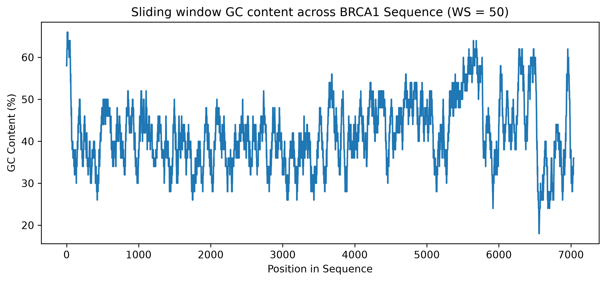

# BRCA1 DNA Sequence Analyzer and SNP Mutation Simulator

This is a beginner-friendly bioinformatics project built using Python. The project analyzes a BRCA1 DNA sequence in FASTA format and performs basic sequence-level analysis such as nucleotide counting, GC content calculation, sliding-window GC visualization, and SNP mutation simulation.

I built this project as part of my transition from a biotechnology background into bioinformatics and computational biology. The goal was to work with a real biological sequence file, understand how genomic data is handled programmatically, and create a clean first-level sequence analysis pipeline.

---

## Project Overview

The project uses a BRCA1 FASTA sequence downloaded from NCBI and processes it using Python. BRCA1 is a well-known human gene associated with DNA repair, and it is widely studied in cancer biology and genomics.

This project does not perform clinical or diagnostic interpretation of BRCA1 variants. Instead, it focuses on foundational bioinformatics skills such as FASTA parsing, sequence cleaning, base composition analysis, GC profiling, visualization, and simple SNP simulation.

---

## Dataset Used

* **Gene:** BRCA1
* **Organism:** Homo sapiens
* **Data source:** NCBI
* **File format:** FASTA
* **Input file used:** `sequence.fasta`

---

## Features

This project performs the following tasks:

* Reads and parses a FASTA file
* Removes the FASTA header and extracts the DNA sequence
* Counts the number of A, T, G, and C bases
* Calculates the overall GC content of the sequence
* Performs sliding-window GC content analysis
* Generates a GC content line plot using Matplotlib
* Simulates a single nucleotide substitution in the first 200 bases
* Compares GC content before and after mutation
* Classifies mutation type as GC to AT, AT to GC, or same-category change
* Displays a small sequence region around the mutation site

---

## Tools and Libraries Used

* Python
* Matplotlib
* NCBI FASTA sequence data

---

## Project Workflow

1. Load the BRCA1 FASTA file
2. Extract and clean the DNA sequence
3. Count nucleotide bases
4. Calculate total GC content
5. Perform sliding-window GC analysis
6. Generate a GC content plot
7. Simulate a SNP mutation
8. Compare original and mutated sequence properties

---

## Example Output

```text
Sequence loaded successfully.
No of A: 2368
No of T: 1759
No of G: 1585
No of C: 1376

Total length: 7088
GC Content: 41.77 %
```

Example mutation output:

```text
Original base at position 25 : G
Mutated base at position 25 : A

Mutation Region:
Original region: CTGACTCCTGAGGAGAAGTCT
Mutated region : CTGACTCCTAAGGAGAAGTCT
                          ^

Mutation Impact Summary:
Original 200-base GC Content: 43.5 %
Mutated 200-base GC Content: 43.0 %
GC Content Difference: -0.5 %
Mutation Type: GC to AT change
```

---

## Visualization

The project generates a sliding-window GC content plot across the BRCA1 sequence.



---

## Why This Project Matters

This project helped me understand how biological sequence data can be handled using Python. Instead of manually working with a DNA sequence, the script reads a real FASTA file, processes it, and extracts meaningful sequence-level information.

The project also helped me connect basic programming concepts such as strings, lists, loops, slicing, functions, and conditional statements with real bioinformatics applications.

---

## Limitations

* This project performs sequence-level analysis only.
* It does not predict disease risk or clinical significance of BRCA1 mutations.
* The SNP simulation is used for learning purposes and does not represent a validated biological variant.
* Protein translation and amino acid impact prediction are not included in this version.

---

## Future Improvements

Possible future improvements include:

* Adding DNA to RNA transcription
* Translating coding sequences into amino acid sequences
* Comparing normal and mutated codons
* Adding support for multiple FASTA files
* Exporting results into a CSV file
* Using Biopython for more advanced sequence analysis

---

## Repository Structure

```text
BRCA1-DNA-Sequence-Analyzer/
│
├── main.py
├── sequence.fasta
├── gc_content_plot.png
├── requirements.txt
└── README.md
```
